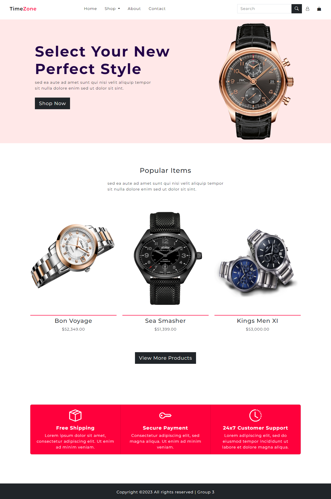
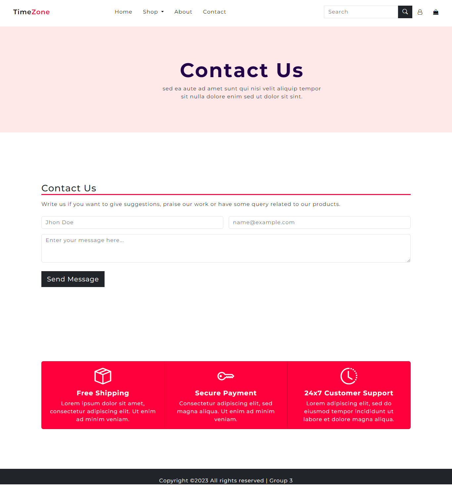
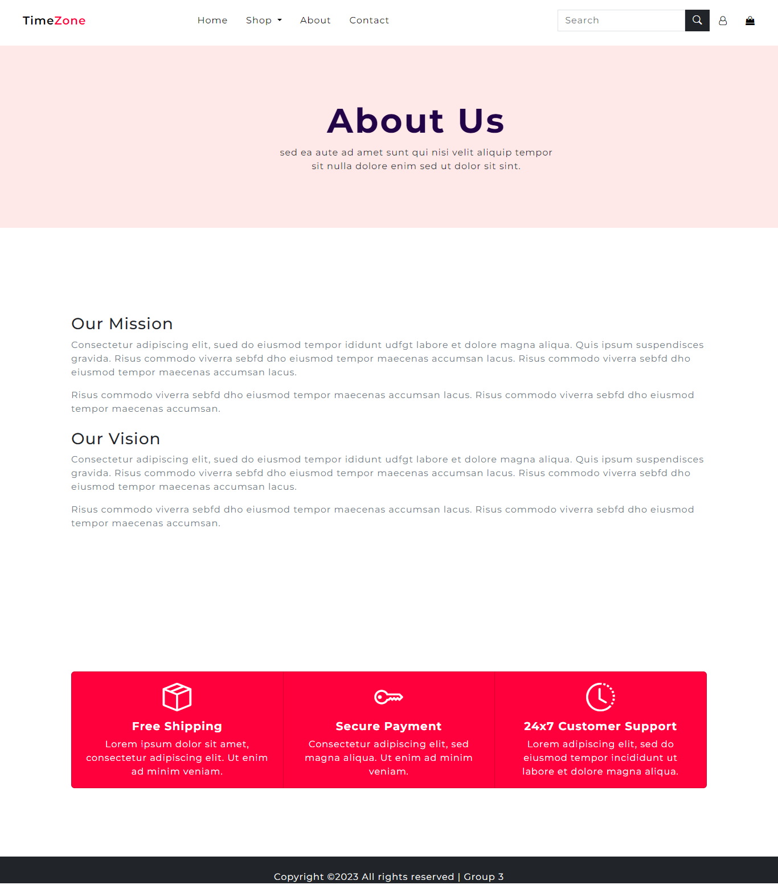
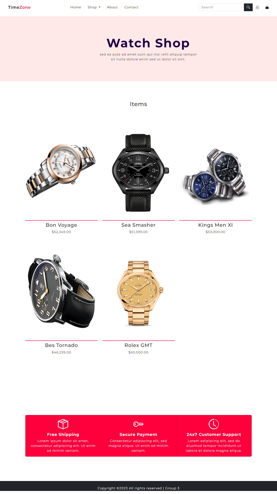
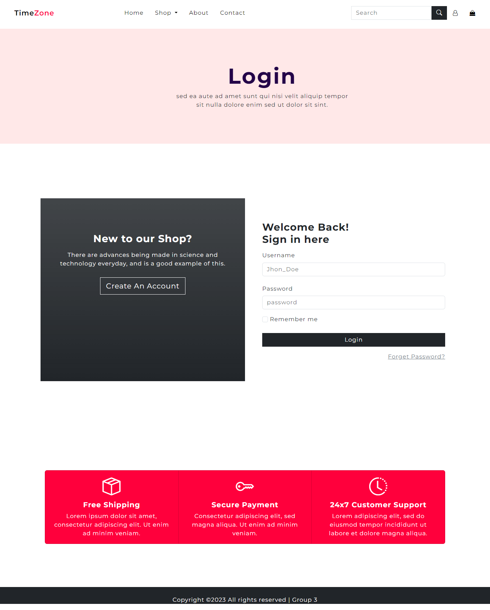
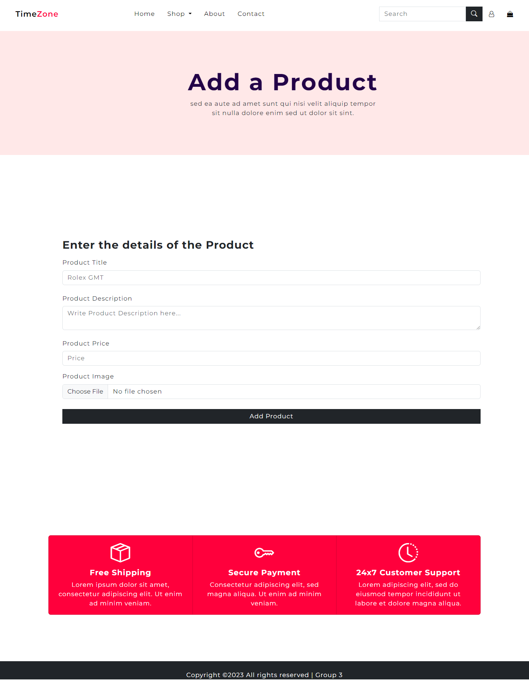

# EcommerceWebsite for Watches

This is an ecommerce website for watches, built using HTML, CSS, and JavaScript. The website has the following pages:

- Home page
- Contact page
- About page
- Shop page
- User login page
- Add product page

Using the Add Product page, users can add products to their local storage. All products that are added using the Add Product page are displayed on the Shop page.

## Getting Started

To get started with the website, simply clone the repository and open the `index.html` file in your web browser. No server or NodeJs installation is required since the website is built using only HTML, CSS, and JavaScript.

## Pages

### Home Page

The home page displays an overview of the website and some featured products.

### Contact Page

The contact page provides users with a form to fill in their contact details and send a message to the website owner.

### About Page

The about page provides information about the website and its purpose.

### Shop Page

The shop page displays all the products that have been added using the Add Product page. Products are displayed in a grid format and users can click on a product to view more details.

### User Login Page

The user login page allows users to login to their account. At the present position of the project, there is no backend, so user authentication is not implemented yet.

### Add Product Page

The add product page allows users to add new products to their local storage. Products are stored as a stringified JSON object in the browser's localStorage.

## Future Plans

In the future, we plan on adding a backend using Java Spring Boot and implementing user authentication. We also plan on using ReactJS to improve the website's user interface and make it more responsive and interactive.
